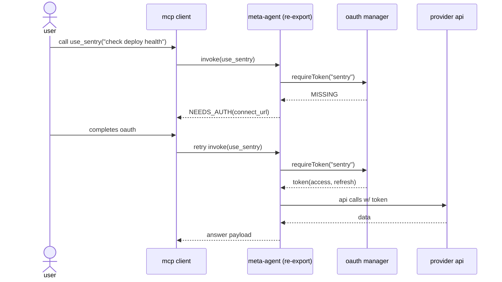

Default to using Bun instead of Node.js.

- Use `bun <file>` instead of `node <file>` or `ts-node <file>`
- Use `bun test` instead of `jest` or `vitest`
- Use `bun build <file.html|file.ts|file.css>` instead of `webpack` or `esbuild`
- Use `bun install` instead of `npm install` or `yarn install` or `pnpm install`
- Use `bun run <script>` instead of `npm run <script>` or `yarn run <script>` or `pnpm run <script>`
- Bun automatically loads .env, so don't use dotenv.

## Testing

Use `bun test` to run tests.

```ts#index.test.ts
import { test, expect } from "bun:test";

test("hello world", () => {
  expect(1).toBe(1);
});
```

## Spec

here’s a tight spec you can hand to eng + pm rn.

# idea

make a meta-agent that (1) manages per-provider oauth above the tool layer and (2) can re-export itself as an MCP server exposing exactly ONE meta-tool (e.g., "use_sentry") that proxies NL prompts to the downstream agent.

# why

* kills context pollution (no 50 tool schemas in every turn).
* preserves NL ux: upstream just calls ONE tool with free-form text.
* lets the downstream agent own tool choice, response quality, and prompt shaping.
* tradeoff: every “provider as agent” hop carries LLM cost + latency.

# architecture (high level)

* **agent core**: routing, memory, policy, small prompt.
* **tool registry**: lazy-loaded tools grouped by provider.
* **oauth manager** (global): runs each provider’s oauth once, stores tokens, refreshes, revokes.
* **token vault**: encrypted storage; per-tenant, per-provider, per-account.
* **capability gate**: tools hidden/disabled until oauth complete for that provider.
* **mcp re-export**: presents a single MCP tool per downstream agent (“use_sentry”, “use_gdrive”, etc.), which internally calls the agent core with the user prompt + tenant/provider context.

# oauth model

* per-provider oauth config:

  * client_id/secret, scopes, auth_url, token_url, pkce: bool, audience, resource.
  * refresh semantics (expires_in, rotating refresh tokens).
* lifecycle:

  1. detect missing token on tool invocation
  2. emit connect_url out-of-band (or return a deterministic MCP error that clients render as “connect”)
  3. poll/callback → store token → mark provider READY
* multi-account: allow N accounts per provider; tag tools as `{provider, account_id}`; default account is sticky per conversation but switchable.
* scoping:

  * **strict**: tools hidden until oauth (zero leakage).
  * **soft**: tools visible but disabled with “connect to enable”; optional depending on product posture.

# runtime flow (happy path)

1. upstream tool call → “use_sentry” with `{prompt: "why are release errors spiking?"}`
2. mcp re-export receives → calls agent core with `{prompt, provider: "sentry"}`
3. agent core picks internal tools (sentry.search_events, sentry.logs, etc.), uses stored token(s)
4. agent crafts answer → returns via single tool’s result payload

# sequence (oauth then query)



# interface sketch (ts-ish)

```ts
type OAuthSpec = {
  authUrl: string
  tokenUrl: string
  clientId: string
  clientSecret?: string
  usePKCE?: boolean
  scopes: string[]
}

type ProviderConfig = {
  id: "sentry" | "gdrive" | string
  oauth: OAuthSpec
  tools: ToolSpec[] // internal, only visible to downstream agent
}

type ToolSpec = {
  name: string
  schema: JSONSchema
  invoke: (args: any, ctx: {token: Token; accountId?: string}) => Promise<any>
}

type AgentConfig = {
  providers: ProviderConfig[]
  oauthStore: TokenStore // per-tenant encrypted vault
  exposure: "strict" | "soft" // gating behavior pre-oauth
}

type MCPExport = {
  toolName: `use_${string}`
  input: { prompt: string; accountId?: string; options?: Record<string,unknown> }
  output: { text: string; citations?: any[]; telemetryId?: string }
}
```

# context hygiene

* upstream context only ever sees ONE tool signature per downstream agent.
* no upstream prompt stuffing of tool catalogs, auth states, etc.
* downstream agent keeps its own system prompt, routing, and tool schemas—opaque to upstream.

# error/edge handling

* **needs_auth**: standardized error code + connect_url + provider_id (+ optional scopes, reason).
* **token_expired**: auto-refresh; if refresh fails → needs_auth.
* **capability_miss**: provider connected but tool unavailable (permissions/scopes) → return actionable hint w/ missing scopes.
* **multi-account**: if ambiguous, return accounts list; allow disambiguation via `accountId`.

# cost + latency tradeoffs (and mitigations)

* cost comes from “agent-as-provider” hop.

  * mitigate via:

    * smaller model for routing/tool use, larger model only for synthesis.
    * caching tool results (ttl + key = {tenant, provider, args}).
    * response compression/summary upstream; full data on demand.
    * tool-first mode (no model) when the request is deterministic (e.g., pure data fetch).
    * batch internal tool calls behind a single model turn using tool-call plans.

# security posture

* least-privilege scopes, scope upgrades explicit.
* encrypted token vault (kms backed), per-tenant, per-provider, per-account.
* audit log: auth events, tool invocations (hashed args), data egress summaries.
* optional consent screen per provider use (“this action will read X”).

# deployment notes

* stateless agent core; token vault external.
* per-provider rate-limiters + circuit breakers.
* telemetry hooks on the mcp tool boundary for s2s observability.

# migration path from “oauth outside the agent”

1. keep the external oauth flow initially; the agent surfaces NEEDS_AUTH with your existing connect_url.
2. add capability gating so requests don’t even plan tools until READY.
3. later, embed the oauth manager (pkce + callback) and remove the hard precondition.

# one-liner you can use

> turn every mcp provider into a self-contained AGENT, broker oauth once at the meta-layer, and expose only a single “use_${provider}” tool upstream—no context smog, natural-language in, curated answers out, with clear (and controllable) cost semantics.

